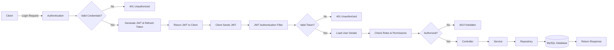
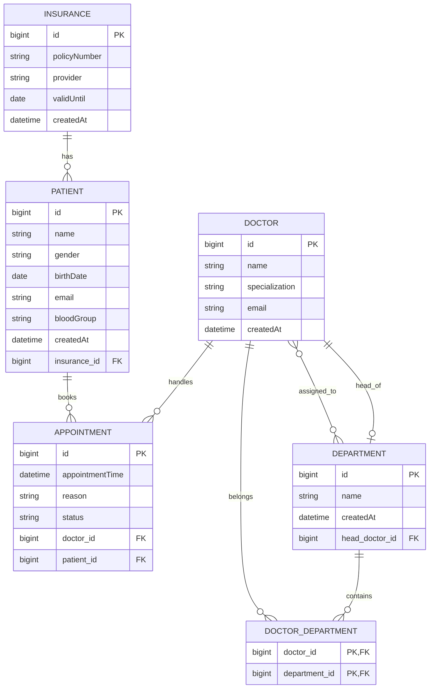
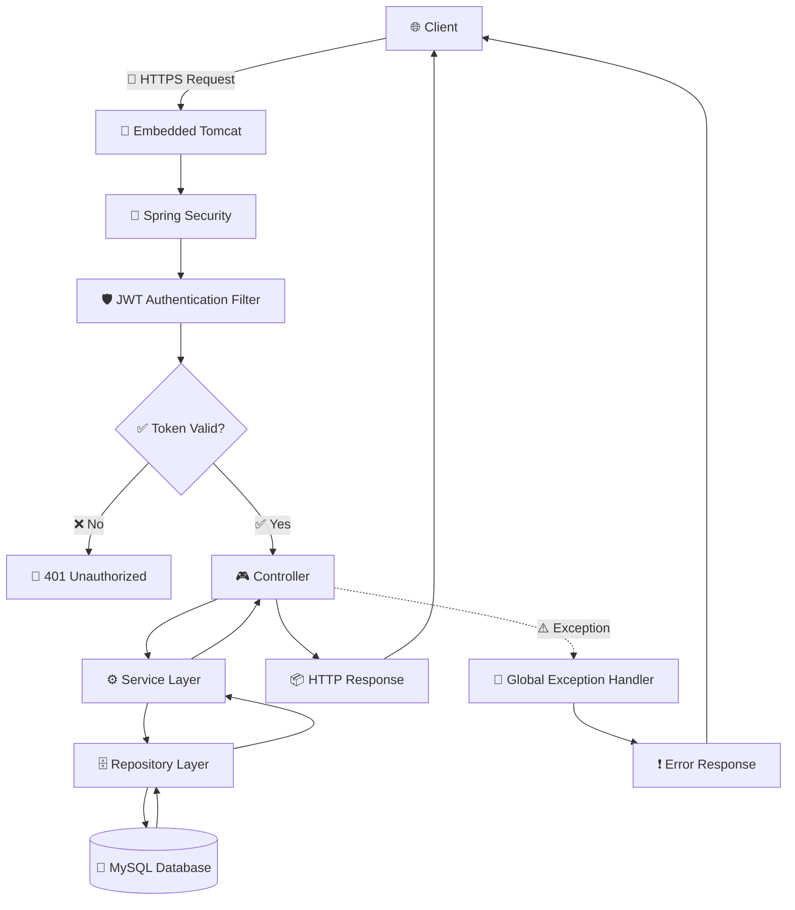
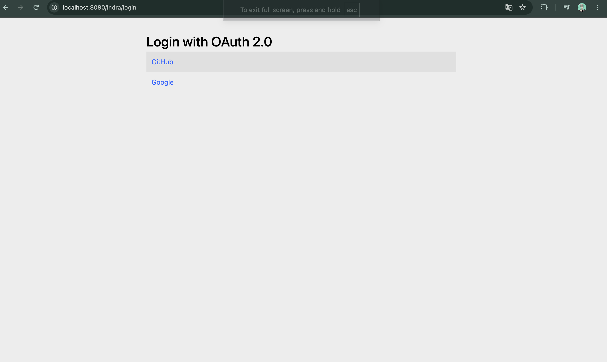
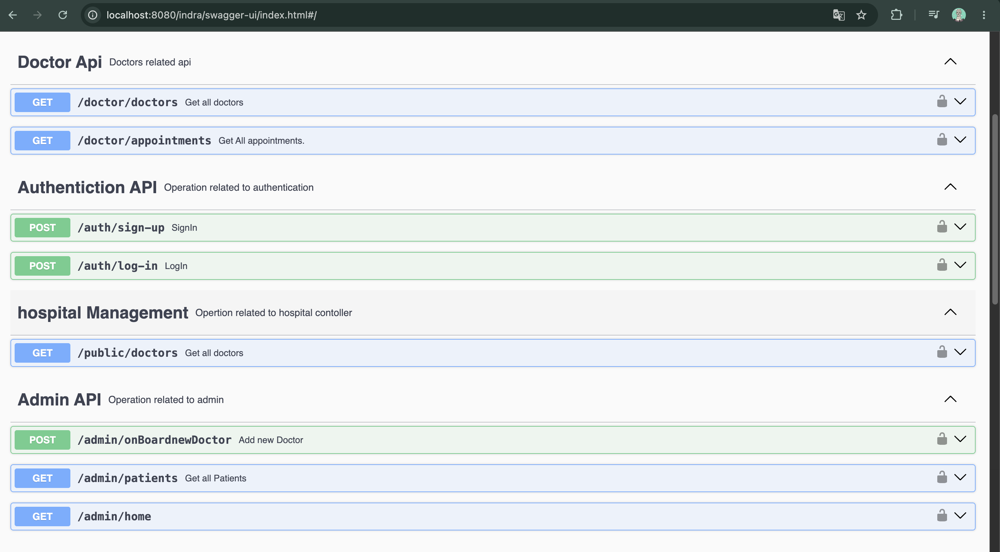
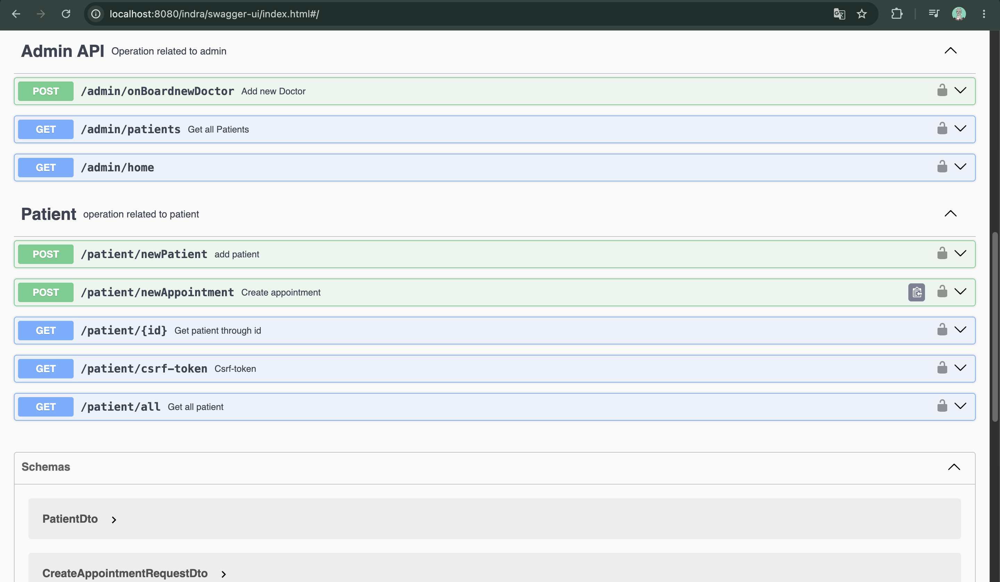
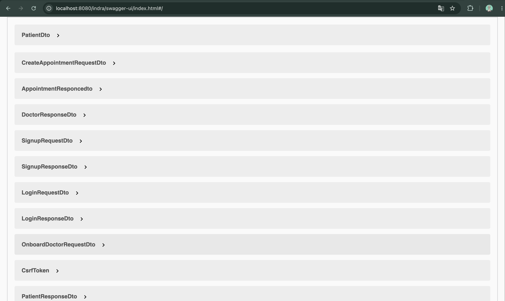

<div align="center">

# 🏥 Hospital Management System

### Enterprise-Grade Hospital Management Backend Using by Spring Boot

*A production-ready, secure, and scalable RESTful backend for managing hospital operations — patients, doctors, appointments, and medical records — built with modern Java engineering practices.*

</div>

<div align="center">


</div>

<p align="center">
  <a href="#-overview">Overview</a> •
  <a href="#-key-features">Features</a> •
  <a href="#-architecture">Architecture</a> •
  <a href="#-installation">Installation</a> •
  <a href="#-api-endpoints">API</a> •
  <a href="#-security">Security</a> •
  <a href="#-contribution-guide">Contributing</a>
</p>

---

## 📑 Table of Contents

- [Overview](#-overview)
- [Key Features](#-key-features)
    - [Authentication & Security](#-authentication--security)
    - [Authorization](#-authorization)
    - [Hospital Features](#-hospital-features)
    - [Database](#-database)
    - [Docker](#-docker)
- [Architecture](#-architecture)
- [Project Structure](#-project-structure)
- [Prerequisites](#-prerequisites)
- [Installation](#-installation)
- [Application Configuration](#-application-configuration)
- [API Endpoints](#-api-endpoints)
- [Docker Commands](#-docker-commands)
- [Database Migration](#-database-migration)
- [Security](#-security)
- [Error Handling](#-error-handling)
- [Author](#-author)

---

## 🩺 Overview

The **Hospital Management System** is a production-ready backend application built with **Spring Boot**, designed to simplify and streamline healthcare management through secure and scalable RESTful APIs.

The system provides comprehensive modules for managing **patients**, **doctors**, **appointments**, and **medical records**, enabling efficient hospital operations with a clean and well-structured architecture.

To ensure enterprise-grade security, the application implements **Spring Security**, **JWT-based authentication**,**OAuth2 Authentication using Google and GitHub**, **Role-Based Access Control (RBAC)**, and **permission-based authorization**, providing fine-grained access control for different user roles.

---

## ✨ Key Features
## 🔐 Authentication & Authorization Flow


### 🏥 Hospital Features

- **Patient Management** — Full CRUD operations for patient profiles, demographics, and medical history.
- **Doctor Management** — Onboarding, specialization tracking, and availability management for doctors.
- **Appointment Management** — Scheduling, rescheduling, cancellation, and status tracking of appointments.
- **Medical Record Management** — Secure creation and retrieval of diagnoses, prescriptions, and treatment history.
- **User Management** — Centralized management of all system users and their credentials.
- **Role Management** — Creation and configuration of roles within the system.
- **Permission Management** — Granular control over what each role or user is allowed to do.

## 🗄️ Database Schema Design

The Hospital Management System follows a **relational database design** to maintain data integrity and efficiently manage relationships between different entities. The schema is normalized to reduce redundancy while ensuring scalability and maintainability.



## 🏗️ Architecture

The application follows a classic **layered (N-tier) architecture**, ensuring clear separation of concerns, testability, and maintainability.

### 🏗️ Application Layer Flow



Each incoming request passes through the `JwtAuthenticationFilter`, which validates the token signature and expiration, loads the user's authorities, and populates the `SecurityContext` — enabling downstream `@PreAuthorize` checks at the controller and service layers.

---

## 🌳 Project Structure
## 📂 Project Structure

```text
Hospital-Management-System
│
├── 📦 src
│   ├── 📂 main
│   │   ├── 📂 java
│   │   │   └── 📂 com.HospitalManagement.ManagedHospital
│   │   │
│   │   │   ├── 📂 configuration
│   │   │   │   ├── OpenApiConfig.java
│   │   │   │   ├── MapperConfiguration.java
│   │   │   │   └── ...
│   │   │   │
│   │   │   ├── 📂 controller
│   │   │   │   ├── AuthController.java
│   │   │   │   ├── AdminController.java
│   │   │   │   ├── DoctorController.java
│   │   │   │   ├── PatientController.java
│   │   │   │   ├── HospitalController.java
│   │   │   │   └── ...
│   │   │   │
│   │   │   ├── 📂 dto
│   │   │   │   ├── request/
│   │   │   │   ├── response/
│   │   │   │   ├── auth/
│   │   │   │   └── ... (All Request & Response DTOs)
│   │   │   │
│   │   │   ├── 📂 entity
│   │   │   │   ├── User.java
│   │   │   │   ├── Patient.java
│   │   │   │   ├── Doctor.java
│   │   │   │   ├── Department.java
│   │   │   │   ├── Appointment.java
│   │   │   │   ├── Insurance.java
│   │   │   │   ├── Admin.java
│   │   │   │   ├── DoctorDepartment.java
│   │   │   │   └── ...
│   │   │   │
│   │   │   ├── 📂 repository
│   │   │   │   ├── UserRepository.java
│   │   │   │   ├── PatientRepository.java
│   │   │   │   ├── DoctorRepository.java
│   │   │   │   ├── AppointmentRepository.java
│   │   │   │   ├── DepartmentRepository.java
│   │   │   │   ├── InsuranceRepository.java
│   │   │   │   └── ...
│   │   │   │
│   │   │   ├── 📂 service
│   │   │   │   ├── AuthService.java
│   │   │   │   ├── PatientService.java
│   │   │   │   ├── DoctorService.java
│   │   │   │   ├── AppointmentService.java
│   │   │   │   ├── DepartmentService.java
│   │   │   │   ├── InsuranceService.java
│   │   │   │   └── ...
│   │   │   │
│   │   │   ├── 📂 security
│   │   │   │   ├── JwtAuthFilter.java
│   │   │   │   ├── WebSecurityConfig.java
│   │   │   │   ├── OAuth2SuccessHandler.java
│   │   │   │   ├── CustomUserDetailService.java
│   │   │   │   ├── RolePermissionMapping.java
│   │   │   │   ├── AuthUtil.java
│   │   │   │   └── ...
│   │   │   │
│   │   │   ├── 📂 error
│   │   │   │   ├── GlobalExceptionHandler.java
│   │   │   │   ├── ApiError.java
│   │   │   │   └── ...
│   │   │   │
│   │   │   ├── 📂 type
│   │   │   │   ├── RoleType.java
│   │   │   │   ├── PermissionType.java
│   │   │   │   ├── AuthProviderType.java
│   │   │   │   ├── BloodGroupType.java
│   │   │   │   └── ...
│   │   │   │
│   │   │   └── 🚀 ManagedHospitalApplication.java
│   │   │
│   │   └── 📂 resources
│   │       ├── 📂 db
│   │       │   └── 📂 migration
│   │       │       ├── V1__initial_schema.sql
│   │       │       └── ...
│   │       ├── 📂 static
│   │       ├── 📂 templates
│   │       ├── application.yml
│   │       ├── application.properties
│   │       ├── application-prod.properties
│   │       └── data.sql
│   │
│   └── 📂 test
│       ├── 📂 service
│       ├── 📂 controller
│       ├── 📂 repository
│       └── ...
│
├── 🐳 Dockerfile
├── 🐳 docker-compose.yml
├── 📦 pom.xml
├── 📄 README.md
└── 📄 .env
```

---

## ✅ Prerequisites

Ensure the following tools are installed before setting up the project:

| Tool | Minimum Version |
|---|-----------------|
| Java (JDK) | 21+             |
| Maven | 3.9+            |
| Docker | 24.x+           |
| Docker Compose | 2.x+            |
| MySQL (if run locally without Docker) | latest          |

---

## 🚀 Installation

### 1️⃣ Clone Repository

```bash
git clone https://github.com/<your-username>/hospital-management-system.git
cd hospital-management-system
```

### 2️⃣ Maven Build

```bash
mvn clean install -DskipTests
```

### 3️⃣ Docker Build

```bash
docker build -t hms-backend:latest -f docker/Dockerfile .
```

### 4️⃣ Docker Network Creation

```bash
docker network create hms-network
```

### 5️⃣ Run MySQL Container

```bash
docker run -d \
  --name hms-mysql \
  --network hms-network \
  -e MYSQL_ROOT_PASSWORD=root \
  -e MYSQL_DATABASE=hospital_db \
  -p 3307:3306 \
  mysql:latest
```

### 6️⃣ Run Spring Boot Container

```bash
docker run -d \
  --name hms-backend \
  --network hms-network \
  -e SPRING_DATASOURCE_URL=jdbc:mysql://hms-mysql:3306/hospital_db \
  -e SPRING_DATASOURCE_USERNAME=root \
  -e SPRING_DATASOURCE_PASSWORD=root \
  -p 8080:8080 \
  hms-backend:latest
```
### 🐳 Run with Docker Compose

Start both the **Spring Boot application** and **MySQL database** in detached mode:

```bash
docker compose up -d
```

Or, if you're using a dedicated `docker/` directory:

```bash
cd docker
docker compose up -d
```

To stop the containers:

```bash
docker compose down
```

To rebuild the images after making changes:

```bash
docker compose up --build -d
```

To view running containers:

```bash
docker compose ps
```

To view application logs:

```bash
docker compose logs -f
```

---


## 📡 API Endpoints

> Base URL: `http://localhost:8080/indra`

### 🔐 Authentication

| Method | Endpoint | Description |
|---|---|---|
| `POST` | `/auth/register` | Register a new user |
| `POST` | `/auth/login` | Authenticate and receive JWT + refresh token |

### 🧑‍🤝‍🧑 Patients

| Method | Endpoint | Description |
|--------|----------|-------------|
| `POST` | `/patient/newPatient` | Create a new patient record |
| `POST` | `/patient/newAppointment` | Book a new appointment for a patient |
| `POST` | `/patients/all` | Retrieve all patient records |
| `GET` | `/patients/{id}` | Retrieve a patient by ID |
### 👨‍⚕️ Doctors

| Method | Endpoint | Description |
|--------|----------|-------------|
| `GET` | `/doctor/doctors` | Retrieve all registered doctors |
| `GET` | `/doctor/appointments` | Retrieve appointments assigned to the logged-in doctor |
### 👨‍💼 Admin

| Method | Endpoint | Description |
|--------|----------|-------------|
| `POST` | `/admin/onBoardnewDoctor` | Add a new doctor to the hospital system |
| `GET` | `/admin/patients` | Retrieve a list of all registered patients |
| `GET` | `/admin/home` | Retrieve the admin dashboard and overview |

---
## 📖 Swagger API Documentation

The project includes interactive API documentation powered by **Swagger UI (OpenAPI 3)**.

The screenshots below provide a complete overview of all available REST endpoints.

### 📄 Swagger API - Oauth2 Authorization

<p align="center">
  <a href="src/main/resources/assets/page-1.png.png">
    
  </a>
</p>

---

### 📄 Swagger API - Page 2

<p align="center">
  <a href="src/main/resources/assets/page-2.png">
    
  </a>
</p>

---

### 📄 Swagger API - Page 3

<p align="center">
  <a href="src/main/resources/assets/page-3.png.png">
    
  </a>
</p>

---

### 📄 Swagger API - Page 4

<p align="center">
  <a href="src/main/resources/assets/page-4.png.png">
    
  </a>
</p>

> 💡 **Tip:** Click on any screenshot to view it in full resolution.


### Role Hierarchy

```
                ┌─────────┐
                │  ADMIN   │  (Full system access)
                └────┬────┘
                     │
                ┌────▼────┐
                │  DOCTOR  │  (Clinical operations)
                └────┬────┘
                     │
                ┌────▼────┐
                │ PATIENT  │  (Self-service access)
                └─────────┘
```
## 🔐 Role-Based Access Control (RBAC)

| Role | Permissions |
|------|-------------|
| **ADMIN** | `PATIENT_READ`, `PATIENT_WRITE`, `APPOINTMENT_READ`, `APPOINTMENT_WRITE`, `APPOINTMENT_DELETE`, `USER_MANAGE`, `REPORT_VIEW` |
| **DOCTOR** | `PATIENT_READ`, `PATIENT_WRITE`, `APPOINTMENT_READ`, `APPOINTMENT_WRITE`, `APPOINTMENT_DELETE` |
| **PATIENT** | `PATIENT_READ`, `APPOINTMENT_READ`, `APPOINTMENT_WRITE` |
---

## ⚠️ Error Handling

The application implements a centralized `@ControllerAdvice`-based exception handler that returns consistent, structured error responses:

```json
{
  "timestamp": "2026-01-15T10:30:00Z",
  "status": 404,
  "error": "Not Found",
  "message": "Patient with ID 42 not found",
  "path": "/api/v1/patients/42"
}
```
---

## 🔮 Future Enhancements

- 📧 Email/SMS notifications for appointment reminders
- 🧾 Billing and invoicing module
- 🗓️ Doctor availability calendar with time-slot booking
- 🧪 Lab test result management

---

## 👤 Author

<div align="center">

**Indrajit Maity**

<a href="https://github.com/indrajit-maity">
  
</a>
&nbsp;
<a href="https://www.linkedin.com/in/indrajit-maity-2a7061285/">
  
</a>
&nbsp;
<a href="mailto:2005indrajitmaity@gmail.com">
  
</a>

</div>

---

